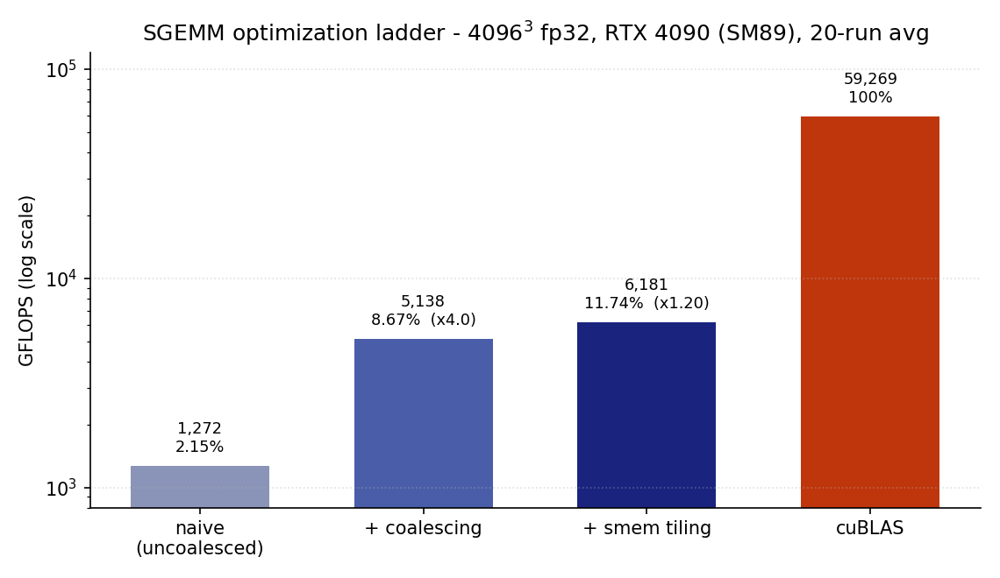

# GPU 学习记录：手写 kernel + 论文笔记

我是刚开始学 CUDA / ML systems 的本科生。这个仓库记录我的两条学习线：**动手线**——从零手写 SGEMM（fp32 矩阵乘法）并一步步优化，所有数字在云端租的 RTX 4090 上实测；**论文线**——围绕"kernel 工程自动化"这个主题读论文、记笔记（Mirage、MPK 等）。两条线是配套的：先亲手写过、调过 kernel，再去读那些想把这件事自动化的工作，能具体看懂它们各自在替代哪部分人工。

## Part 1 · 手写 SGEMM 逐级优化

### 目前的成绩（4096³，fp32，20 次取平均）

| 版本 | GFLOPS | %cuBLAS | 相对上一版 |
|---|---|---|---|
| cuBLAS | 59269 | 100% | — |
| v0 naive（uncoalesced） | 1272 | 2.15% | 起点 |
| v1 + memory coalescing | 5138 | 8.67% | **×4.0** |
| v2 + shared memory tiling | 6181 | 11.74% | **×1.20** |

另外做了一个 bank conflict 对照实验：故意制造冲突慢了 66%，加 padding 修回约三分之一（22.1 → 36.6 → 31.6 ms，见下文）。



### 我怎么测的

- GPU：云上租的 RTX 4090（Ada / SM89），CUDA 13.0，`nvcc -O3 -arch=native`
- 每个 kernel 先跑 3 次热身，再跑 20 次取平均；只计 kernel 本身，不算 CPU↔GPU 拷贝
- 正确性：每个 kernel 都先和 cuBLAS 对答案、通过了才计时。不能要求每一位完全相等——浮点加法不满足结合律，两边求和顺序不同，结果就有微小出入。我一开始把绝对误差阈值设成 1e-4，K=4096 时有 2 个（共 1600 万个）接近 0 的元素过不了线，查下来是 fp32 的累加噪声（几个 kernel 彼此的结果是一致的），于是放宽到 1e-3
- 特意测了 300×200×77 这种除不尽的尺寸，防止边界处理藏 bug

### 三个版本各做了什么

#### v0 → v1：memory coalescing，×4.0

两版代码几乎一样，只是线程编号和矩阵行/列的对应方向反了。这里学到的关键一课：GPU 上 32 个编号相连的线程（一个 warp）永远同一拍发出访存请求——如果它们要的地址连成一片，硬件一趟就全搬回来；如果每人隔一整行，就得一趟一趟各自跑。就这一个区别，1272 → 5138 GFLOPS。书上常说这个差距有 5–10 倍，我只测到 4 倍，猜测是 4090 的 L2 缓存较大、替慢的那版兜了部分底——还没用 profiler 验证过。

#### v1 → v2：shared memory tiling，×1.20

我发现 naive 版里同一行的 32 个线程其实在反复读同一批 A 元素——每人都自己去显存取一遍。v2 把 C 切成 32×32 的小块，分轮处理：每轮全 block 协作把当前用到的 A、B 小块搬进 shared memory，`__syncthreads()` 同步后大家从片上取数计算，算完再同步一次进下一轮。

写这个 kernel 踩的两个坑：① 边界上的线程要"搬个 0"，不能提前 return——否则 `__syncthreads()` 永远等不齐人，kernel 直接卡死；② 两次同步一次都不能少，少了结果会随机错（每次错的位置还不一样）。

理论上显存流量降到 1/32，实际只快 1.2 倍。查资料的解释：naive 版本来就被 L2 缓存救了不少；区别在于缓存是硬件自动的、靠运气，shared memory 是自己管理的、命中有保证。现在瓶颈仍是访存（算术强度约 8 FLOP/B），所以下一步打算做 register blocking。

#### 附加实验：shared memory 的 bank conflict

shared memory 分成 32 个 bank（地址每 4 字节轮流归属，下标 mod 32 = bank 号），同一 warp 的线程若同时访问同一 bank 的不同地址就要排队。我故意把 As 转置存放，让写入地址间隔恰好 32 个 float，结果是全部撞进同一个 bank，慢了 66%；按资料上的办法把声明改成 `[32][33]`（每行多一个空位错峰），就改善了很多。

## Part 2 · 论文阅读笔记

围绕"kernel 工程怎么被自动化"这条主题线在读，笔记都在 [`notes/`](notes/)：

- **Mirage: A Multi-Level Superoptimizer for Tensor Programs（OSDI'25）**——已精读，[笔记](notes/notes-mirage.md)。一句话：µGraph 把 kernel/block/thread 三层统一画成图，"换算法、调调度、造新 kernel"三类人工优化变成同一个图空间里的搜索问题；抽象表达式剪枝让空间搜得动，有限域随机测试让搜出来的结果可信。
- **MPK: Mirage Persistent Kernel（OSDI'26）**——先读了作者的博客版，[笔记](notes/notes-mpk-blog.md)，论文深读排期中。一句话：把整个 LLM 推理编译成单个 megakernel，编译器拆任务图、kernel 内运行时用 worker/scheduler 去中心化调度，消掉 launch 开销、让计算和通信重叠。
- **PipeThreader（OSDI'25）**——目前只读了摘要，深读排期中。

### 三篇放在一起的理解

之前了解的三个工作是可以串在一起的：Mirage 解决的是单个 kernel 的构造和优化；PipeThreader 解决 kernel 内部的流水线排布（以前负责这部分的硬件调度器，无法应付复杂程度高的 kernel）；MPK 则更进一步，移除了每个 kernel 的边界，将它们融合成一个巨大的 megakernel（连多卡通信也一并塞进去）。三者串在一起，把优化的决策权逐步从人工和硬件搬到了编译器上。因为前段时间手写和优化过 kernel，我能具体体会到它们各自想替代的人工环节是什么——Mirage 替代的是我调 kernel 的部分，PipeThreader 替代的是我排"搬数据-同步-计算"节奏的部分。

还没想明白的一个问题：这三级会不会最终融合成一个系统？如果有实现的可能，当前还缺什么？

## 目录结构

```
01_vector_add/     入门练习：vector add + 带宽测量
02_naive_gemm/     v0 / v1 + CPU 参考实现 + 校验和跑分框架
03_smem_tiling/    v2（TILE 是模板参数，自动扫 8/16/32）+ bank conflict 实验
common/            错误检查 / 计时器 / 数值校验 / cuBLAS 封装（row-major 调法）
notes/             论文阅读笔记
plots/             性能图
results.md         全部原始数据
```

## 复现

```bash
cd 02_naive_gemm && make && ./sgemm --selftest && ./sgemm --bench
cd ../03_smem_tiling && make && ./sgemm_smem && ./bank_conflict
```

## 接下来的计划

- 代码：register blocking（1D/2D thread tiling）→ float4 向量化 → double buffering；再上 Triton / TileLang 和手写版同表对比
- 论文：PipeThreader、MPK 深读；两处标了"猜测/推测"的归因等学会用 profiler 后回来验证

## 我看的资料

- Simon Boehm, *How to Optimize a CUDA Matmul Kernel*
- CMU 15-779: Advanced Topics in ML Systems（Zhihao Jia），Lecture 3 / 11
- Zhihao Jia, *Compiling LLMs into a MegaKernel*（MPK 博客版）
- 谭升《CUDA 编程》博客
